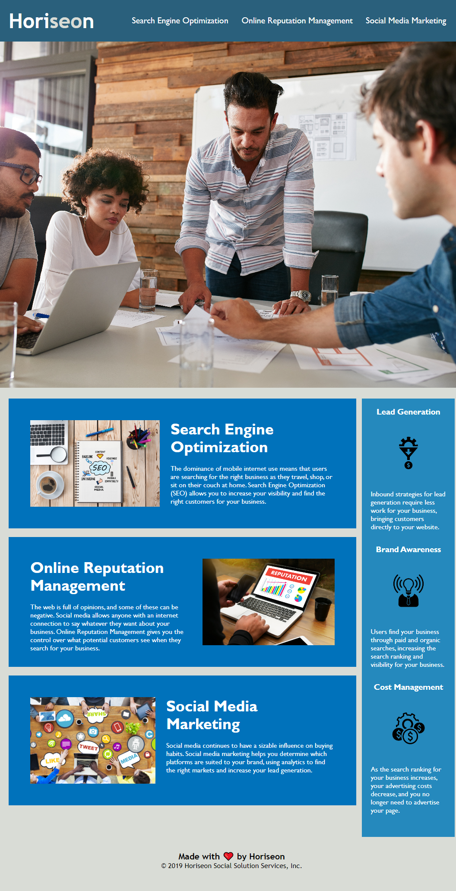

#Horiseon
##Description

The motivation for this project is to code refactor the website so that is more user accessible for someone who may have visual impairments. Additional motivation was to clean up the code by replacing the div elements with semantic HTML selectors so that the code is easier to read, as well as allowing developers to navigate the code in a timely fashion to make changes/add more commits. This project was built so that the website/application could become more user friendly to the non-developers who are using the application to learn more information about Horiseon. 

The problem that this solves is that it makes the applciation more user friendly and allows the application to used by multiple cohorts.

Something that I learned from this is that there are a number of ways to make websites and applications user friendly by adding alt tags to the images, as well as adding semantic HTML elements to the code so that the developers can search through the code of the website more easily. I also learned how important it is to add comments to the HTML and CSS documents so that future developers can see what was added to each section of the code when they inspect it in future scenarios.

